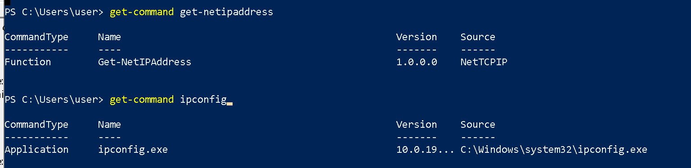

# cmd-to-powershell
Attempts to map various CMD enumerations to powershell version without creating executable process.

| cmd | Powershell |
|---------------------------------------|--------------------------------------------------------|
|whoami.exe	                            | "$env:userdomain\$env:username" |
|			                                  | [Security.Principal.WindowsIdentity]::GetCurrent().Name |
|whoami.exe /priv                       | ./whoami-priv.ps1 |
|tasklist.exe	                          | Get-Process |
|Ipconfig.exe	                          | get-netipaddress |
|Netstat.exe	                          | Get-NetTcpConnection |
|Sc.exe queryex type= service state= all| Get-Service |
|									                      | Get-CimInstance -ClassName Win32_Service |
|ping.exe      | Test-NetConnection |
|Tracert.exe   | Test-NetConnection -TraceRoute |
|Route.exe     | Get-NetRoute |
|Systeminfo.exe| Get-computerinfo; Get-Hotfix |
|Nslookup.exe  | Resolve-dnsname |
|Net.exe user  | Get-localuser \| Select-Object -Property Name,Enabled,LastLogon,SID,PasswordRequired |
|              | Get-CimInstance -Class Win32_UserAccount |
|Net.exe use   | New-SmbMapping |
|Net.exe share | Get-Smbshare |
|              | Get-CimInstance -ClassName Win32_Share |
|set           | ls env: |
|              | [Environment]::GetEnvironmentVariables() |
| Reg.exe query HKLM\SYSTEM\<remainingpath> | ls HKLM:\SYSTEM\<remainingpath> |

Prior to running your command, use `get-command` to verify whether the CommandType is `Application` and whether the Source is mapped to disk. 

Windows will log Process Creation event id 4688 under "Microsoft-Windows-Security-Auditing" when powershell spawns the underlying executable. This would include any cmdline that you passed into the executable as arguments.

